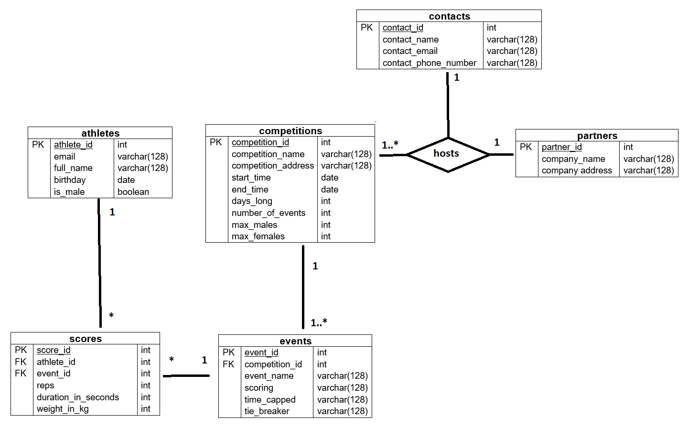

# CSI2532 - Competition Leaderboard Project

## Membres de l'équipe
Alexandre Pineau  
300066713  
apine018@uottawa.ca

## Livrable 4
Notes:
* J'utilise Microsoft Word et Paint pour créer les schémas visuels
* J'utilise PHP et PostgreSQL pour l'application
* J'utilise le serveur web inclus avec PHP (et non Apache)
* Le README pour le livrable 1 est nommé "deliverable1.md"
* Le README pour le livrable 2 est nommé "deliverable2.md"
* Le README pour le livrable 3 est nommé "deliverable3.md"
* La présentation est dans `/presentation.pptx`

## Instructions de setup 
Voici les étapes pour rouler le web app
1. Il faut avoir PostgreSQL et PHP configuré sur votre machine locale
2. Les fichiers PHP connect un DB avec les crédentiels `"host=localhost port=5432 dbname=csi2532 user=postgres password=root"`. Ces fichers sont tous dans `\web` et `\web\pages`.
3. Sur votre DB personel, exécute le fichier "schema.sql" pour créer les tables
4. Ensuite, exécute le fichier "seed.sql" pour populé ces tables avec des données
5. À partire du répertoire /web, run la commande `php -S localhost:8080`
6. Dans votre browser visite "localhost:8080" et le site devrait s'apparitre

## Instructions pour le API
1. Vas au fin de la page sur le site au section "Admins"
2. Entrer le token "123abc"
3. De là, les admins peut ajouter des partenaires et inscrire des athletes à des competitions
4. Également, les admins on access a tout le MeFit Data; ceux vont illustrer un `SELECT *` du donneé choisi

## Modele ER


## Modele relationnel


## Exemples SQL
### SELECT
Query pour montrer l'info général sur le site
```sql
SELECT competitions.competition_name, competitions.competition_address, competitions.start_time, partners.company_name, contacts.contact_name, contacts.contact_email, contacts.contact_phone_number
FROM hosts
INNER JOIN competitions ON competitions.competition_id = hosts.competition_id
INNER JOIN partners ON partners.partner_id = hosts.partner_id
INNER JOIN contacts ON contacts.contact_id = hosts.contact_id
ORDER BY competitions.start_time ASC
```

### INSERT
Ajouter des evenements
```sql
INSERT INTO events (event_id, competition_id, event_name, scoring, time_capped, tie_breaker)
VALUES
    (1, 1, '100kg Hold', 'Time DESC', 'No', 'Yes'),
    (2, 1, '1 Ton Run', 'Time ASC', 'No', 'No'),
    (3, 1, 'Biggest Lift', 'Weight DESC', 'No', 'No'),
    (4, 2, '1 Km Race', 'Time ASC', 'No', 'No'),
    (5, 2, '5 Km Race', 'Time ASC', 'No', 'No'),
    (6, 3, 'Pushups', 'Reps DESC', 'Yes', 'Yes'),
    (7, 4, '2Km Frontcrawl', 'Time ASC', 'No', 'No'),
    (8, 4, '2Km Breaststroke', 'Time ASC', 'No', 'No'),
    (9, 5, '1 Min Jumps', 'Reps DESC', 'Yes', 'No'),
    (10, 5, '5 Min Jumps', 'Reps DESC', 'Yes', 'No')
```

### UPDATE
Changer le nom d'un evenement
```sql
UPDATE events
SET event_name = '200kg hold'
WHERE event_id = 1
```

### DELETE
Enlever l'evenment 10
```sql
DELETE FROM events
WHERE event_id = 10
```

## Notes additionels
- Le fichier web/index.php contient toute le code pour créer le leaderboard
- Le fichier web/script.js contient toute le code pour trier le leaderboard
- Le répertoire /pages contient toutes les pages pertinent aux admins
- J'utilise Bootstrap et JS pour le front end