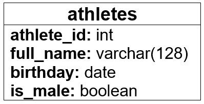
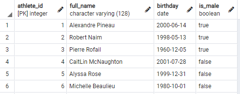
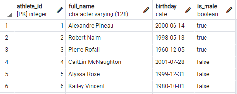
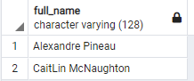
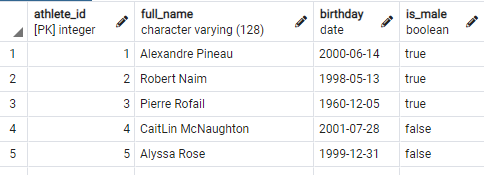

# CSI2532 - Competition Leaderboard Project

## Membres de l'équipe
Alexandre Pineau  
300066713  
apine018@uottawa.ca

## Livrable 1
Notes:
* J'utilise Microsoft Word pour les schémas visuels
* J'utilise pgAdmin et le DB de uOttawa

### Modele ER


### Modele relationnel


### Schéma SQL
```sql
CREATE TABLE athletes (
  athlete_id int,
  full_name varchar(128),
  birthday date,
  is_male boolean,
  primary key (athlete_id)
);
```

### Exemples SQL
Insert example
```sql
INSERT INTO athletes
  (athlete_id, full_name, birthday, is_male)
VALUES
  (1, 'Alexandre Pineau', '06-14-2000', true),
  (2, 'Robert Naim', '05-13-1998', true),
  (3, 'Pierre Rofail', '12-05-1960', true),
  (4, 'CaitLin McNaughton', '07-28-2001', false),
  (5, 'Alyssa Rose', '12-31-1999', false),
  (6, 'Michelle Beaulieu', '10-01-1980', false);
```

  
Update example
```sql
UPDATE athletes
SET full_name = 'Kailey Vincent'
WHERE athlete_id = 6
```

  
Select example
```sql
SELECT full_name 
FROM athletes
WHERE birthday > '01-01-2000'
```


Delete example
```sql
DELETE FROM athletes
WHERE full_name = 'Kailey Vincent'
```
